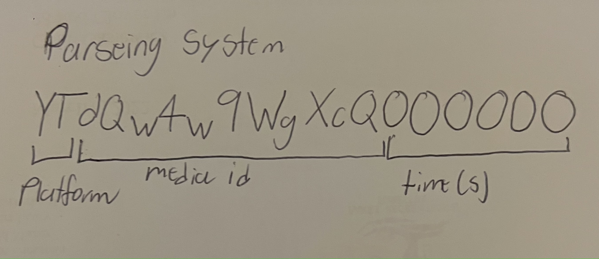

# WatchTogether
This is in development.

Watch togetjer is an extension that allows you to watch media together with your friends. The porgram can sync the source and time of the media by shareing a code with your friends.
## Platforms I hope to get this to work with 

youtube

Netflix

Disny+

## To do 

add code gen

add code retrival

